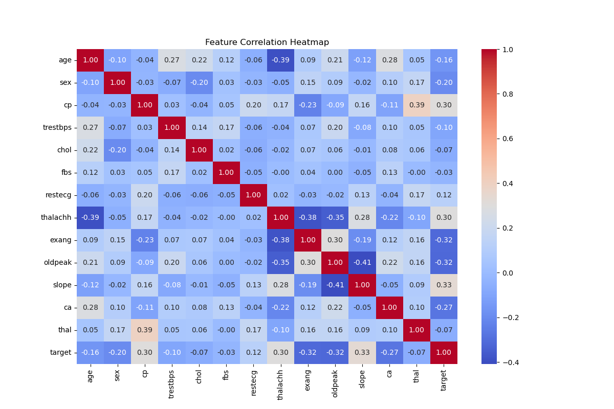
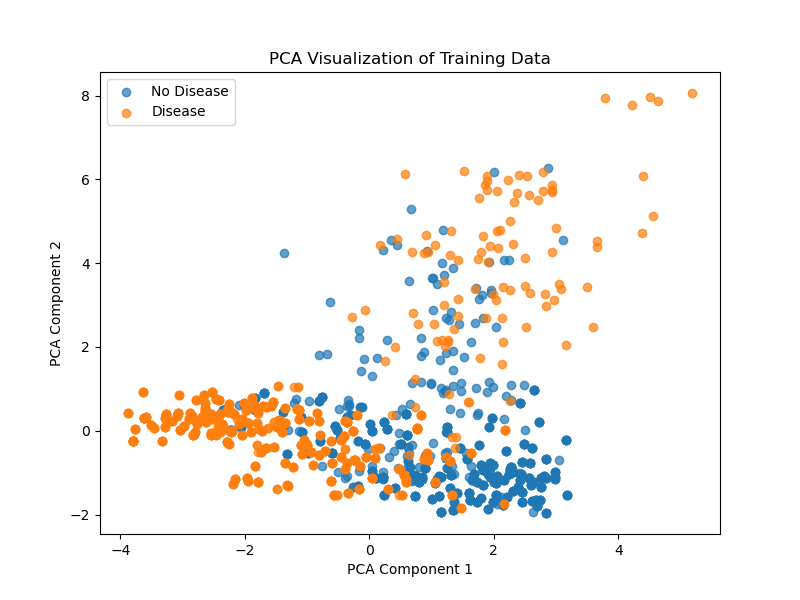
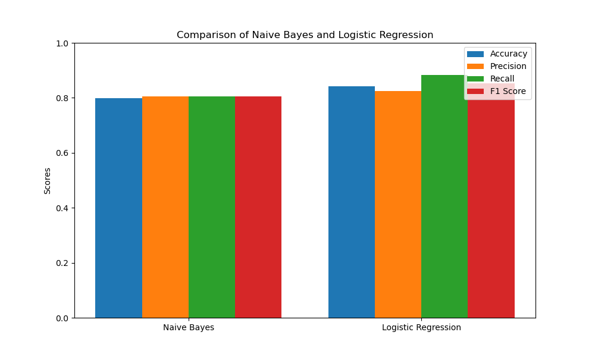

# Comparative Study of Naive Bayes and Logistic Regression for Heart Disease Prediction  

This project presents a comparative study of two machine learning algorithms — **Naive Bayes** and **Logistic Regression** — applied to heart disease prediction using clinical features.  

---

## 📦 Requirements  

Ensure that you have **Python 3.x** installed.  
The following Python libraries are required:  

- numpy  
- pandas  
- matplotlib  
- seaborn  
- scikit-learn  

---

## ⚙️ Installation  

Install all dependencies using `pip`:  

```bash
pip install numpy pandas matplotlib seaborn scikit-learn
```
---


## 📂 Dataset  

The dataset contains features such as age, sex, chest pain type, blood pressure, cholesterol levels, and other attributes relevant to predicting heart disease. The dataset used in this project can be found on Kaggle:  
[Heart Disease Dataset](https://www.kaggle.com/datasets/mfarhaannazirkhan/heart-dataset)  

---

# Heart Disease Prediction: Naive Bayes vs Logistic Regression  

This project demonstrates the application of **Naive Bayes** and **Logistic Regression** to predict heart disease using clinical features. The dataset was explored through visualization and further refined using **Principal Component Analysis (PCA)** to reduce dimensionality and remove feature correlations.  

Both models were evaluated using **Accuracy, Precision, Recall, and F1-score**, providing a clear comparison of their predictive capabilities.  
- **Naive Bayes** served as a simple yet effective baseline.  
- **Logistic Regression** achieved more robust and reliable performance, especially after feature scaling.  

---

## 📊 Dataset Visualization  

To understand feature relationships and dataset structure, we performed exploratory visualization:  

  
*Figure 1: Correlation heatmap of dataset features*  

  
*Figure 2: 2D PCA projection of the dataset*  

---

## ⚙️ Methodology  

The dataset was divided into **80% training** and **20% testing**.  
Both classifiers were trained on the training set and evaluated on the test set using the following metrics:  

- **Accuracy** → fraction of correct predictions  
- **Precision** → proportion of correct positive predictions  
- **Recall** → proportion of actual positives correctly identified  
- **F1-score** → harmonic mean of precision and recall  

---

## 📈 Results and Discussion  

### 🔹 Performance Metrics  

| Model               | Accuracy | Precision | Recall | F1-score |
|----------------------|----------|-----------|--------|----------|
| Naive Bayes         | 0.799    | 0.806     | 0.806  | 0.806    |
| Logistic Regression | 0.841    | 0.824     | 0.883  | 0.852    |

### 🔹 Comparison Plot  

  

**Conclusion:**  
Logistic Regression **outperformed Naive Bayes** across all metrics, making it the preferred model. Its higher accuracy and ability to handle correlated features led to more reliable predictions. PCA visualization further highlighted class separability in the dataset.  

---
